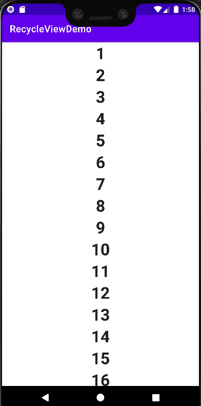

# Simple RecycleView / LazyColumn Demo

## Requirements
- Android Studio Bumblebee or later

## Articles
- Step-by-step Guides to Implement RecycleView
- Convert RecycleView to LazyColumn - Jetpack Compose

## Branches
- [master](https://github.com/vinchamp77/Demo_SimpleRecycleView/tree/master) - Simple RecycleView Demo (Implemented using Android View System)
- [compose](https://github.com/vinchamp77/Demo_SimpleRecycleView/tree/compose) - Simple LazyColumn Demo (Implemented using Jetpack Compose)
- [master vs compose diff](https://github.com/vinchamp77/Demo_SimpleRecycleView/compare/master...compose)
